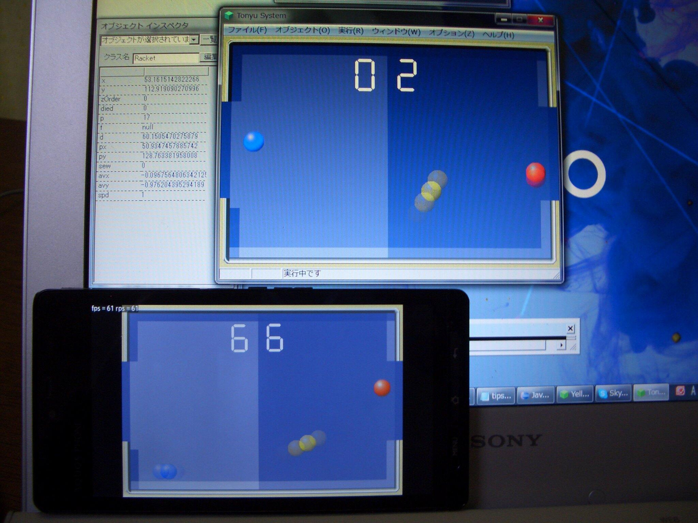
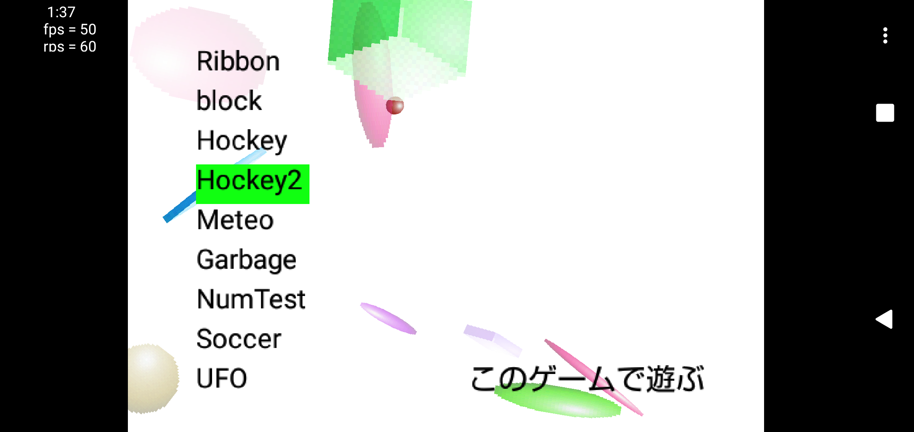
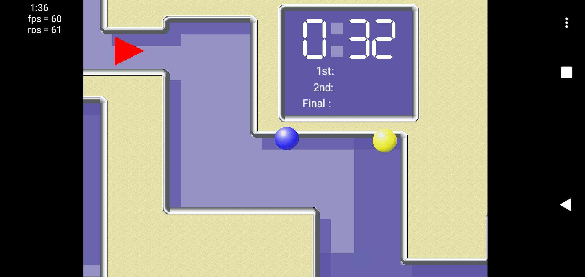
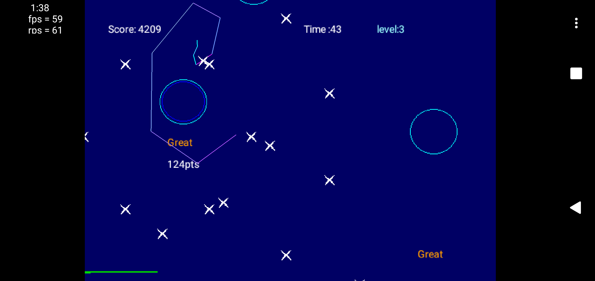
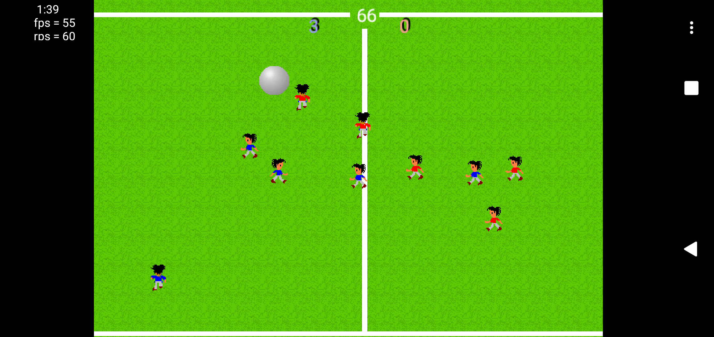

# Tonyu1SamplesAndroidOld

Tonyu System 1 のサンプルゲームをAndroidに移植した版です。

Android 2.3や4.0の時代に作った古いプロジェクトのため、修正などは行いません。  
過去プロジェクトとして置いてみました。

|||
|-|-|
|開発時期|2013年～2014年|
|IDE|Eclipse|
|言語|Java|
||OpenGL ES 1.1|
|compileSdkVersion|Android 2.2 (API 8)|

## 備考

- jniがあるのは、C/C++化しようとした痕跡で、そのまま残骸として残っています。無くても動きます。
- other/TALMapCreater.tonyu は、Tonyu1のマップをこのアプリで使える形式に変換するソースコードです。Tonyu1で実行します。
- other/icon.pbx は、PictBearで編集できます。

## スクリーンショット

 

&nbsp; 
&nbsp; 
